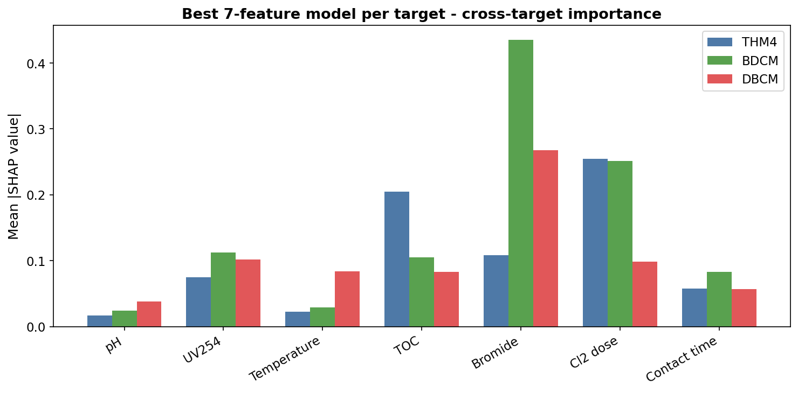
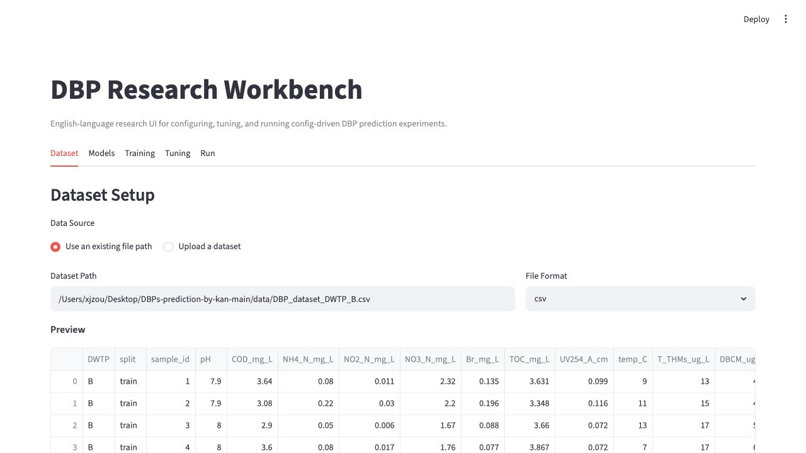

# DBP Prediction

> Reproducible tabular machine-learning experiments for predicting drinking-water disinfection by-products (DBPs).

[](https://www.python.org/downloads/)
[](LICENSE)
[](https://github.com/zxjzxjnb/DBP_Prediction_xz/actions/workflows/ci.yml)

## Overview

This repository provides a config-driven workflow for predicting disinfection by-products in drinking water from water-quality features. It compares neural and tree-based models under shared data splits, feature pipelines, tuning settings, and artifact tracking.

The current main research workflow uses a formal **U.S. Dataset** with seven input features:

- pH
- UV254
- temperature
- TOC
- bromide
- chlorine dose
- contact time

The project predicts three DBP targets:

| Target | Internal column | Meaning |
| --- | --- | --- |
| THM4 | `thm4_in_avg` | Total trihalomethanes |
| DBCM | `dbcm_in_avg` | Dibromochloromethane |
| BDCM | `bdcm_in_avg` | Bromodichloromethane |

The repository also includes a smaller 175-row packaged benchmark for lightweight examples and compatibility with earlier KAN experiments.

## Visual Outputs





## What This Project Includes

- A Python package, `dbp_prediction`, for dataset loading, feature processing, model training, tuning, and artifact writing.
- YAML experiment configs under `experiments/`.
- A unified CLI, `dbp run <config>`, for preparing and running experiments.
- Model adapters for MLP, KAN, Random Forest, and XGBoost.
- Optuna-based hyperparameter tuning with cross-validation.
- SHAP-based attribution scripts for model interpretation.
- Tests for data handling, configs, feature transforms, models, metrics, CLI, runner, and tuner logic.

This is a research workflow, not a production prediction service.

## Repository Structure

```text
.
|-- dbp_prediction/              # Main Python package
|   |-- datasets/                # Dataset readers and split helpers
|   |-- features/                # FeaturePipeline and transforms
|   |-- models/                  # MLP, KAN, Random Forest, XGBoost adapters
|   |-- engine/                  # Runner, evaluator, tuner, training orchestration
|   |-- schemas/                 # Dataset and experiment config schemas
|   |-- cli/                     # Command-line entry points
|   `-- ui/                      # Optional Streamlit research UI
|-- experiments/                 # YAML experiment configs
|-- scripts/                     # SHAP, reporting, and analysis scripts
|-- data/                        # Git-tracked datasets
|-- results/                     # Git-tracked analysis outputs
|-- output/                      # Reports, slides, and poster artifacts
|-- tests/                       # Pytest suite
|-- pyproject.toml               # Package metadata and dependencies
|-- environment.yml              # Conda environment
`-- README.md
```

Experiment runs write artifacts to `checkpoints/`. This folder is ignored by Git because model checkpoints can be large.

## Installation

### Option 1: Conda

```bash
git clone https://github.com/zxjzxjnb/DBP_Prediction_xz.git
cd DBP_Prediction_xz

conda env create -f environment.yml
conda activate kan_model
pip install -e ".[dev]"
```

### Option 2: venv / pip

```bash
git clone https://github.com/zxjzxjnb/DBP_Prediction_xz.git
cd DBP_Prediction_xz

python -m venv .venv
source .venv/bin/activate
python -m pip install --upgrade pip
pip install -e ".[dev]"
```

Optional UI dependencies:

```bash
pip install -e ".[ui]"
```

Optional interpretation/reporting dependencies:

```bash
pip install -e ".[analysis]"
pip install fpdf2 pillow
```

## Quick Start

### 1. Check that the CLI is available

```bash
dbp --help
```

### 2. Validate an experiment config without training

```bash
dbp run experiments/per_target_baseline.yaml \
  --prepare-only \
  --run-id smoke_test \
  --output-dir tmp/smoke_test \
  --print-plan
```

This command reads the YAML file, resolves dataset paths, inspects the data split, and writes a run plan under `tmp/smoke_test/`.

### 3. Run the test suite

```bash
pytest
```

### 4. Run an experiment

```bash
dbp run experiments/per_target_baseline.yaml --print-plan
```

The output directory contains a run-specific folder with:

```text
resolved_config.json
dataset_snapshot.json
run_plan.json
artifact_manifest.json
metrics/model_comparison.json
```

If model saving is enabled, model checkpoints are also written there.

## Datasets

### U.S. Dataset

Path:

```text
data/dataset1_dbp_formation_with_split.csv
```

Summary:

| Item | Value |
| --- | ---: |
| Rows | 514 |
| Columns | 193 |
| Predefined train rows | 406 |
| Predefined test rows | 108 |

The formal 7-feature experiments use:

```text
ph_in_avg
uv_in_avg
temp_in_avg
toc_in_avg
br_in_avg
cl2d_in_avg
time_sds_avg
```

The U.S. Dataset contains missing values, so formal configs usually include a `drop_missing` feature step for complete-case evaluation.

Known provenance and licensing boundary:

- This repository tracks the processed CSV used by the formal experiments, including the predefined train/test split.
- The current repository files do not contain a primary publication, agency source, or standalone data license for the underlying U.S. Dataset measurements.
- The MIT license in this repository covers the code unless a data source states otherwise. Before using the U.S. Dataset outside this research repo, add the original data citation/license or replace it with a documented public release.

### Packaged Benchmark

Path:

```text
data/DBP_dataset_DWTP_B.csv
```

Summary:

| Item | Value |
| --- | ---: |
| Rows | 175 |
| Predefined train rows | 141 |
| Predefined test rows | 34 |

This smaller dataset is useful for quick examples and legacy comparisons.

Known provenance and licensing boundary:

- The packaged benchmark is tracked in `data/DBP_dataset_DWTP_B.csv` and mirrored inside the package at `dbp_prediction/_data/DBP_dataset_DWTP_B.csv`.
- The repository-level MIT license covers the code. Confirm the original measurement source and reuse terms before treating this CSV as independently licensed public data.

## Experiment Configs

Experiments are controlled by YAML files in `experiments/`. A config declares:

- the dataset path, features, targets, and split column
- the task strategy
- feature-processing steps
- model families and parameters
- training defaults
- tuning settings
- output location

Minimal shape:

```yaml
dataset:
  path: ../data/dataset1_dbp_formation_with_split.csv
  format: csv
  features:
    - ph_in_avg
    - uv_in_avg
    - temp_in_avg
    - toc_in_avg
    - br_in_avg
    - cl2d_in_avg
    - time_sds_avg
  targets:
    - thm4_in_avg
  split:
    strategy: predefined
    column: split
    train_label: train
    test_label: test

task:
  strategy: per_target
  targets:
    - thm4_in_avg

features:
  steps:
    - name: drop_missing

models:
  - name: random_forest
    alias: rf
    params:
      n_estimators: 350
      max_depth: 16

training:
  seed: 42
  max_epochs: 1200
  patience: 100
  batch_size: 16
  lr: 0.001
  weight_decay: 0.0001
  val_fraction: 0.15

tuning:
  enabled: true
  folds: 5
  stability_penalty: 0.18

outputs:
  dir: ../checkpoints/formal_dataset1_7feat_cl2d_contact_time_thm4_avg
  save_models: true
  save_predictions: true
```

Currently implemented execution path:

- task strategy: `per_target`
- split strategies: `predefined` / `column`
- model families: `mlp`, `kan`, `random_forest`, `xgboost`

Registered feature transforms include `drop_missing`, `impute`, `scale`, `select_columns`, `log1p`, `log`, `interaction`, `ratio`, `polynomial`, and `target_transform`.

## Main Experiment Commands

### Formal 7-feature U.S. Dataset runs

```bash
dbp run experiments/formal_dataset1_7feat_cl2d_contact_time_thm4_avg.yaml --print-plan
dbp run experiments/formal_dataset1_7feat_cl2d_contact_time_bdcm_avg.yaml --print-plan
dbp run experiments/formal_dataset1_7feat_cl2d_contact_time_dbcm_avg.yaml --print-plan
```

### Feature ablation runs

```bash
dbp run experiments/formal_dataset1_5feat_avg.yaml --print-plan
dbp run experiments/formal_dataset1_6feat_cl2d_avg.yaml --print-plan
dbp run experiments/formal_dataset1_6feat_contact_time_dbcm_avg.yaml --print-plan
```

### Scout runs

```bash
dbp run experiments/scout_dataset1_5feat_avg.yaml --print-plan
dbp run experiments/scout_dataset1_6feat_cl2d_avg.yaml --print-plan
dbp run experiments/scout_dataset1_6feat_contact_time_avg.yaml --print-plan
dbp run experiments/scout_dataset1_7feat_cl2d_contact_time_avg.yaml --print-plan
```

Scout runs are useful for exploring promising parameter ranges before formal tuning.

## Results

The table below summarizes the strongest documented formal 7-feature U.S. Dataset results. Metrics are held-out test metrics from the corresponding formal run artifacts.

| Target | Best model | RMSE | MAE | R2 | Main SHAP features |
| --- | --- | ---: | ---: | ---: | --- |
| THM4 | Random Forest | 37.378 | 25.934 | 0.855 | Chlorine dose, TOC, bromide |
| BDCM | Random Forest | 8.430 | 6.321 | 0.843 | Bromide, chlorine dose, UV254 |
| DBCM | MLP | 4.924 | 3.338 | 0.713 | Bromide, UV254, chlorine dose |

Tracked metric artifacts behind this table:

```text
results/formal_dataset1_7feat_metrics/thm4/model_comparison.json
results/formal_dataset1_7feat_metrics/bdcm/model_comparison.json
results/formal_dataset1_7feat_metrics/dbcm/model_comparison.json
```

Reference config files:

```text
experiments/formal_dataset1_7feat_cl2d_contact_time_thm4_avg.yaml
experiments/formal_dataset1_7feat_cl2d_contact_time_bdcm_avg.yaml
experiments/formal_dataset1_7feat_cl2d_contact_time_dbcm_avg.yaml
```

Fresh runs generate new `metrics/model_comparison.json` files under `checkpoints/`. The historical formal-run metric JSON files used in the table above are also copied under `results/formal_dataset1_7feat_metrics/` so a fresh clone can audit the reported numbers without requiring local checkpoint artifacts. Trained model checkpoints remain under ignored `checkpoints/` because they can be large.

## Interpretation and Reports

Precomputed report and interpretation outputs are tracked in `results/` and `output/`. To rerun the scripts below from a fresh clone, first regenerate the required formal model checkpoints by running the formal experiment configs.

SHAP analysis for the best formal 7-feature models:

```bash
python scripts/shap_analysis_dataset1_7feat_best.py \
  --thm4-run-dir checkpoints/formal_dataset1_7feat_cl2d_contact_time_thm4_avg/<run_id> \
  --bdcm-run-dir checkpoints/formal_dataset1_7feat_cl2d_contact_time_bdcm_avg/<run_id> \
  --dbcm-run-dir checkpoints/formal_dataset1_7feat_cl2d_contact_time_dbcm_avg/<run_id>
```

If the run-dir arguments are omitted, the script uses the latest run directory under each corresponding formal checkpoint folder.

SHAP interaction analysis:

```bash
python scripts/shap_interaction_dataset1.py \
  --thm4-run-dir checkpoints/formal_dataset1_7feat_cl2d_contact_time_thm4_avg/<run_id> \
  --bdcm-run-dir checkpoints/formal_dataset1_7feat_cl2d_contact_time_bdcm_avg/<run_id> \
  --dbcm-run-dir checkpoints/formal_dataset1_7feat_cl2d_contact_time_dbcm_avg/<run_id>
```

Formal 7-feature PDF report:

```bash
python scripts/generate_dataset1_7feat_report_pdf.py
```

Existing report and presentation outputs:

```text
output/pdf/dataset1_7feat_formal_report.pdf
output/pdf/dataset1_ablation_cl2_report.pdf
output/pdf/shap_attribution_study_report.pdf
output/DBP_Prediction_Overview.pptx
output/poster/dbp_prediction_ihe_poster.pptx
```

Interpretation boundary: SHAP results are feature-attribution evidence from trained models. They should not be presented as causal chemical mechanism proof.

## Streamlit UI

Install optional UI dependencies:

```bash
pip install -e ".[ui]"
```

Launch:

```bash
dbp-ui
```

The UI uses the same backend experiment runner as the CLI and helps build, preview, and run experiment configs.

## Testing and Code Quality

Run all tests:

```bash
pytest
```

Run focused tests:

```bash
pytest tests/test_runner.py
pytest tests/test_tuner.py
pytest tests/test_features.py
```

Lint:

```bash
ruff check dbp_prediction tests
```

Format:

```bash
ruff format dbp_prediction tests
```

GitHub Actions runs the same lint and test checks on every push and pull request.

## Notes for Future Work

- Keep formal claims tied to specific dataset, target, model family, and run artifact.
- Keep U.S. Dataset results separate from packaged benchmark results.
- Preserve small historical metric JSON files under `results/`; keep large model checkpoints under ignored `checkpoints/`.
- Extend split strategies only after adding tests in the dataset/splitter layer.
- Treat SHAP findings as model-attribution evidence rather than causal proof.

## Acknowledgments

This project is based on [DBPs-prediction-by-kan](https://github.com/XiaoyanLi-enviro/DBPs-prediction-by-kan) by **Xiaoyan Li** (2024), licensed under the [MIT License](LICENSE).
